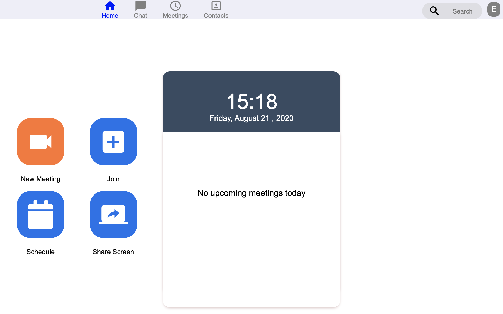

# Projeto Zoom App Clone da JS Expert Week 2.0

Lecionado por: [Erick Wendel](https://github.com/ErickWendel)

- Acesse o [home](./aula04/public/pages/home/index.html) para acessar a home page
- Acesse o [room](./aula04/public/page/room/index.html) uma room específica

## Home Page

## Room

### Créditos

- Layout da home foi baseada no codepen do [Nelson Adonis Hernandez](https://codepen.io/nelsonher019/pen/eYZBqOm)
- Layout da room foi adaptado a partir do repo do canal [CleverProgrammers](https://github.com/CleverProgrammers/nodejs-zoom-clone/blob/master/views/room.ejs)
